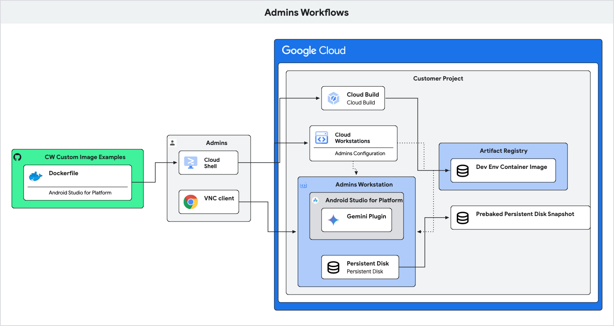

# Cloud Workstations for Android Automotive Platform Development

This provides guidance on setting up and using Cloud Workstations for Android
Automotive platform development. It focuses on reducing the time it takes to
start coding and complete an initial build, aiming for under 3 minutes. The
solution leverages
[Android Studio for Platform](https://developer.android.com/studio/platform)
(ASfP) as the Integrated Development Environment (IDE), with an optional
integration for
[Gemini Code Assist](https://cloud.google.com/gemini/docs/codeassist/overview)
on [Cloud Workstations](https://cloud.google.com/workstations).

This guide demonstrates critical developer workflows on Cloud Workstations,
allowing development teams to pilot the solution and benchmark it against their
existing local development solution. Then, the result of the time and cost
savings can be used to plan for further adoption, automation, and
optimization with existing Continuous Integration (CI) and Continuous Delivery
(CD) pipelines.

## Administrator Workflows

Administrators are responsible for setting up development environments,
pre-baking persistent disk snapshots, and creating Cloud Workstations
configurations for developers. By including the code, prebuilt targets, and an
ASfP project in the snapshots, the time and cost for each developer to start
their development workflows are reduced significantly. A snapshot and a workstation configuration can be
created for each development branch and build targets according to the need of each development team.



## Prerequisites

Cloud Workstations require the following:

1.  **External IP Access:** To download Android source code, either the
    [compute.vmExternalIpAccess](https://console.cloud.google.com/iam-admin/orgpolicies/compute-vmExternalIpAccess)
    policy is set to ALLOW for the project, or when
    [disablePublicIpAddresses](https://cloud.google.com/workstations/docs/reference/rest/v1/projects.locations.workstationClusters.workstationConfigs#GceInstance.FIELDS.disable_public_ip_addresses)
    is set to true to disable public IP addresses, you must set up Private
    Google Access or Cloud NAT on your network.
2.  **Nested Virtualization:** To run an Android virtual device for testing, the
    workstation configuration
    [enableNestedVirtualization](https://cloud.google.com/workstations/docs/reference/rest/v1/projects.locations.workstationClusters.workstationConfigs#GceInstance.FIELDS.enable_nested_virtualization)
    should be set to true for the project. Which requires [compute.disableNestedVirtualization](https://console.cloud.google.com/iam-admin/orgpolicies/compute-disableNestedVirtualization) is not enforced for the project.
3.  **AOSP Development Environment Container Image:** To build Android device
    targets,
    [the android-studio-for-platform image](../../examples/images/android-open-source-project/android-studio-for-platform/README.md)
    must be built first. It takes about 20 min to build.

## Create a Workstation for Administrators

Follow these steps to create a workstation for administrators:

1.  [Create a repository in Artifact Registry](https://cloud.google.com/artifact-registry/docs/repositories/create-repos).
2.  [Create a workstation cluster](https://cloud.google.com/workstations/docs/create-cluster).
    It takes about 20 min to create.
3.  [Create a workstation configuration](https://cloud.google.com/workstations/docs/create-configuration)
    for Administrators. Administrators need a powerful workstation to
    perform a clean build for Android build targets, such as
    [n1-standard-96](https://cloud.google.com/compute/docs/general-purpose-machines#n1_machine_types).
4.  [Create a workstation](https://cloud.google.com/workstations/docs/create-workstation)
    for Administrators.

For example, the [create_admin_workstation.sh](./scripts/create_admin_workstation.sh) script performs the above steps
for a given project: `./scripts/create_admin_workstation.sh -p my-gcp-project`

### AAOS 15 Build Time and Storage Usage

The following are the approximate time and storage requirements for pre-baking
AAOS 15. These values should be used to set the
[RUNNING_TIMEOUT](https://cloud.google.com/sdk/gcloud/reference/workstations/configs/create#--running-timeout), e.g. 4 hours and the
[PD_DISK_DIZE](https://cloud.google.com/sdk/gcloud/reference/workstations/configs/create#--pd-disk-size), e.g. 1 TB for the workstation configuration for Administrators. These values may
need to be adjusted based on the specific build targets.

1.  25 min. to download the source code.
2.  70 min. to build aosp_cf_x86_64_auto-ap4a-userdebug.
3.  60 min. to build cts.
4.  100 min. to sync and index for the ASfP project.
5.  550 GB is used in the home directory.

## Pre-bake Persistent Disk Snapshots

Administrators pre-bake a persistent disk snapshot by downloading the Android
source code, building the required build targets, setting up an ASfP project,
and then creating a snapshot.

Follow these steps:

1.  Launch the workstation for administrators.
2.  Download the code for Android Automotive OS (AAOS) 15 and build an auto
    Cuttlefish Virtual Device (CVD): `aosp_cf_x86_64_auto-ap4a-userdebug` and
    [CTS](https://source.android.com/docs/compatibility/cts/development). For
    example:
    [/google/scripts/build_vcar.sh](../../examples/images/android-open-source-project/android-studio-for-platform/assets/google/scripts/build_vcar.sh).
3.  [Setup ASfP to create a project](https://developer.android.com/studio/platform/projects),
    sync and index the codebase. For example, a project configuration file at
    `/home/user/AsfpProjects/vcar/asfp-config.json` is as:

    ```
    {
      "repoRoot" : "/home/user/aaos/vcar",
      "modulePaths" : [
        "cts",
        "packages",
        "frameworks"
      ],
      "lunchTarget" : "aosp_cf_x86_64_auto-ap4a-userdebug",
      "nativeConfig" : {
        "excludePaths" : [ ],
        "excludeGenPaths" : [
          "*"
        ]
      },
      "syncConfig" : {
        "environmentVars" : { },
        "buildFlags" : [ ]
      }
    }
    ```

4.  Verify the build by running test cases against the CVD in ASfP:

    *   Run the script
        [/google/scripts/start_vcar_cvd.sh](../../examples/images/android-open-source-project/android-studio-for-platform/assets/google/scripts/start_vcar_cvd.sh)
        to start the CVD.
    *   Open `CipherTest.java` in the ASfP project.
    *   Click the **Run** icon to
        [test platform code](https://developer.android.com/studio/platform/test).

    

5.  Stop the CVD and clean up:

    *   Run the script
        [/google/scripts/stop_vcar_cvd.sh](../../examples/images/android-open-source-project/android-studio-for-platform/assets/google/scripts/stop_vcar_cvd.sh)
        to stop the CVD.
    *   Run the script
        [/google/scripts/cleanup_for_snapshot.sh](../../examples/images/android-open-source-project/android-studio-for-platform/assets/google/scripts/cleanup_for_snapshot.sh)
        to clean up.

6.  Identify the persistent disk of the workstation and create a snapshot.

    ```
    # Get the source disk from the admin workstation
    source_disk=$(gcloud compute disks list \
    --filter="labels.google-devops-environments-assigned-environment:${WORKSTATION}" \
    --format="value(name)" \
    --project=${PROJECT})

    gcloud compute snapshots create ${SNAPSHOT} \
    --source-disk=${source_disk} \
    --source-disk-region=${LOCATION} \
    --storage-location=${LOCATION} \
    --project=${PROJECT}
    ```

## Create a Workstation Configuration for Developers

Administrators
[create a workstation configuration](https://cloud.google.com/workstations/docs/create-configuration)
for developers, by using the snapshot as the source for the home disk.
Workstations for developers can use a lower-cost machine type, such as
`n1-standard-16`, as developers only need to perform incremental builds.

For example to create a configuration: vcar-cvd-cts-20250307

```
gcloud workstations configs create "vcar-cvd-cts-20250307" \
    --project=${PROJECT} \
    --region=${LOCATION} \
    --cluster=${CLUSTER} \
    --machine-type=n1-standard-16 \
    --enable-nested-virtualization \
    --enable-ssh-to-vm \
    --container-custom-image=${dev_img_name}:latest \
    --service-account=${service_account} \
    --pd-disk-type=pd-ssd \
    --pd-source-snapshot=${SNAPSHOT} \
    --running-timeout=${WORKSTATION_TIMEOUT}
```

## Developer Workflows

1.  Developers
    [create a workstation](https://cloud.google.com/workstations/docs/create-workstation)
    from the configurations created by administrators to begin each development task, such as implementing a feature or fixing a
    bug. They also can create multiple workstations to work on different tasks
    concurrently.
2.  Code, build, test and upload the change until it's reviewed, tested, and merged.
3.  Delete the workstation.
